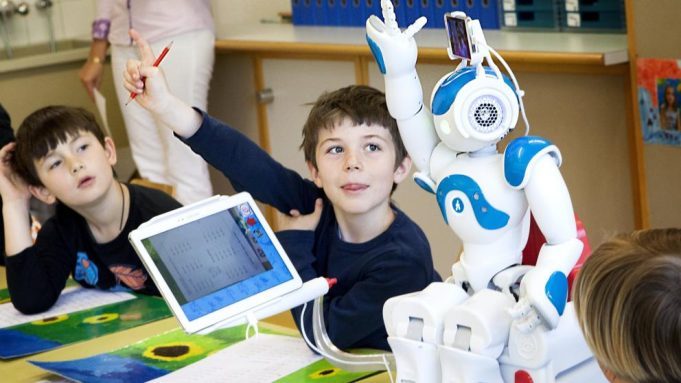

La inteligencia artificial (IA) puede ser una herramienta valiosa en el campo de la educación. La IA puede ayudar a personalizar la enseñanza para cada estudiante, adaptando el contenido y el ritmo del aprendizaje a las necesidades individuales de cada uno.<!--truncate--> Esto puede ayudar a mejorar los resultados de aprendizaje y aumentar la motivación de los estudiantes.

La IA también puede ayudar a los educadores a analizar y evaluar el progreso de los estudiantes, lo que les permite identificar rápidamente las áreas en las que un estudiante puede necesitar ayuda adicional y adaptar la enseñanza en consecuencia.

Además, la IA puede ser utilizada para desarrollar material educativo más atractivo, lo que puede ayudar a mantener a los estudiantes interesados y comprometidos en su aprendizaje.

Un estudio realizado por la Universidad de Stanford en 2016 encontró que los estudiantes que utilizaron un sistema educativo basado en IA mejoraron significativamente sus resultados en comparación con aquellos que recibieron una educación tradicional.

En resumen, la IA puede ser una herramienta valiosa en la educación, ya que puede ayudar a personalizar el aprendizaje, mejorar la evaluación del progreso de los estudiantes y desarrollar material educativo más atractivo.

[Link del estudio mencionado](https://web.stanford.edu/~cpiech/bio/papers/aiEducation.pdf)
